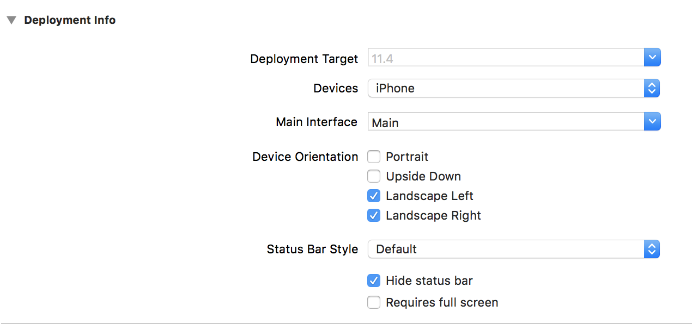
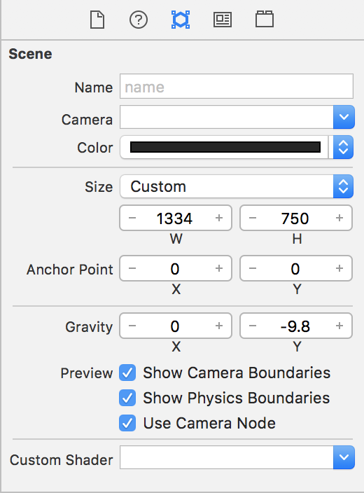
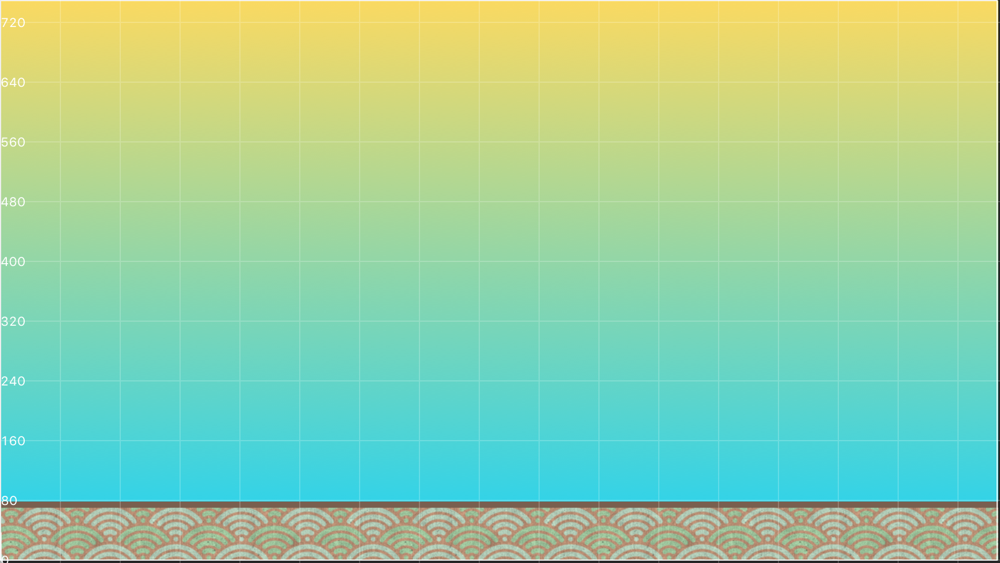
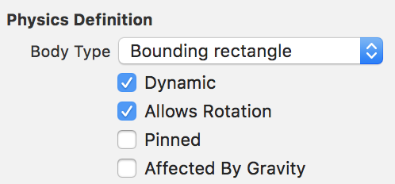
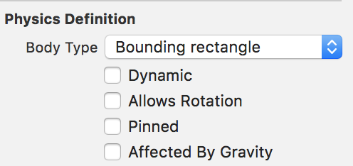
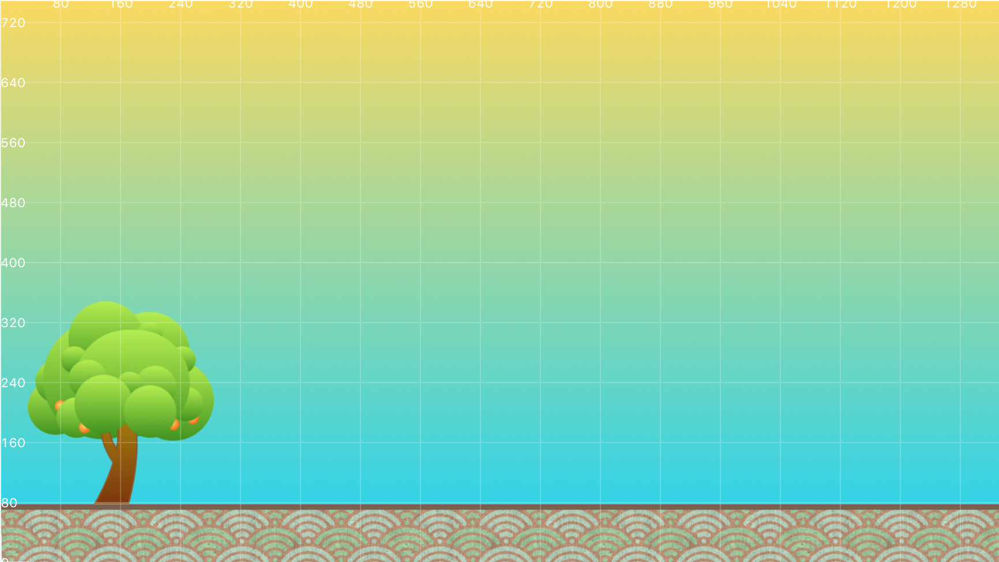

I'm sure you are as excited as I am to start flinging oranges around, I mean who wouldn't want to fling 'em!
Before we can do that though we need to set up our scene and get some basic assets in place.

> [action]
> Let's start by removing the `Actions.sks` file.

Great! Now let's do some configuration of our scene. Orange Tree will be played in *landscape* mode, just like Angry Birds.
We need to change a setting in our project file to ensure our game does not try and run in *portrait* mode by mistake.

> [action]
> Open the project file (the top one in your project tree). Go to *Deployment Info* and uncheck the *portrait* setting
> under *Device Orientation*. Your *Deployment Info* section should now look like this.
> 

Now that our project will only run in *landscape*, open the *GameScene.sks* file so that we can finish our setup.

> [action]
> Open `GameScene.sks` and start by deleting the default `helloLabel` node.
> The object tree for the *GameScene* should now be empty.
> Next, select the *Scene* object at the top of the object heirarchy and click the *Attributes Inspector*.
> The default settings are set for portrait mode, change that by setting the *width* to `1334` and the *height* to `750`.
> We are also going to change the *Anchor Point* to `(0,0)`.
> 

## Our First Assets

Right now our scene is looking pretty boring. Luckily we can change that pretty quickly as we already have some assets
that were provided for us. We are going to set up the background and the 'player', aka the orange tree, by placing them
in our scene.

> [action]
> In the project navigator on the left, open `assets.atlas`. Look for an image named `background.png` and drag it into
> the scene. Make sure that you center it inside the white viewable area rectangle. It should snap into place.
> Check that the position is set to `(667, 375)`, set the *Name* to `background`, and set the *Z Position* to `-2`.
> Now grab the image named `Background.png` and drag it into the scene. Snap it to the bottom of the view so that it
> is centered. Check that the position is set to `(667, 39)` and then set the *Name* property to `ground`.
> If everything went well, your scene should now look like this.
> 

## Getting Down to Earth

Now that we have some basic assets in the scene, we need to configure some special settings. If you have ever played the
game Angry Birds, you know that the objects in the game interact with each other like they would in real life. When objects
hit each other, mainly when the angry birds fly into objects, they get knocked over and can bump into each other.

You might be asking yourself at this point, how in the world you are going to be able to simulate real physics like those games!
Don't worry, Apple has already done this for you and it is part of the SpriteKit framework! Three cheers for Apple, woohoo!

> [info]
> If you want to know more about the physics engine in SpriteKit, 
> this [link](https://medium.com/@jjacobson/spritekit-physics-14331398b308) is a good place to start.
> You may have also seen a setting on the *Scene* object called *Gravity* that has a value of `-9.8`
> for the *y* value. If you have taken a physics class, this will be familiar as the constant for gravity
> here on earth, 9.8 meters per second.
> 

Alright, so we don't need to make a physics engine. What do we need to do to make our objects interact with each other?
Well for starters, if you run the game right now you will notice that not a whole lot happens. Let's change that and see
the magic of this built in physics engine!

> [action]
> Open *GameScene.sks* and click on the *ground* node in the object tree. Make sure you are looking at the *Attributes Inspector*
> window. Locate the *Physics Definition* section, you may need to scroll down, and set the *Body Type* to `Bounding Rectangle`.
> You may have noticed a bunch of properties just became available. For now we are going to leave all the settings how they are.
> Now, run the game using the `CMD+R` shortcut.

Woah! What happened to our *ground* node? It's almost as if gravity pulled it out of our scene ;]

> [challenge]
> Take a look at the settings for the *ground* node's physics body and see if you can figure out how to prevent our node
> frome sinking through the bottom of our scene.

<!-- -->

> [solution]
> The setting that we want to make sure that we turn off is called *Affected By Gravity*. Unchecking that box
> should make sure that our ground node does not go flying off in to the unknown.
> 

If you run the game now, you should see that your *ground* node no longer falls off the bottom of the screen. To make sure that
the *ground* node stays in place when other objects collide we need to change two more settings. These settings will be
discussed in further detail later in the tutorial, so don't worry if you don't understand what they mean now.

> [action]
> Locate the *Physics Definiton* settings and uncheck *Dynamic* and *Allows Rotation*. Very briefly, the *Dynamic*
> setting tells the physics engine whether or not this node will move or whether it will be static. The *Allows Rotation*
> setting tells the engine whether or not the node can rotate. Again, more deatil on these settings later!
>
> Check that your *Physics Definiton* matches the picture below before moving on.
> 

<!-- -->

> [info]
> Before we move on to our last step, I wanted to point out that there are many more settings in the *Physics Definition*
> than we dealt with. We are going to leave these as they are for now. If you want to find out more about them, I encourage
> you to do some reading in the [documentation](https://developer.apple.com/documentation/spritekit) to learn more about it.
> We are not going to spend any more time on it for now though.

## Putting the Tree in Orange Tree

The last step for this section will be adding the Orange Tree!

> [action]
> Locate *OrangeTree.png* in the *assets.atlas* folder and drag it into the scene. It should snap to the top of the *ground*
> node. It should snap into place at `(160,213)`. This looks like a perfect place for our tree! The last thing we need to do
> is set the *Z Position* to `-1` and the *Name* to `tree`. Run your project and check that it looks like the image below.
> 

# Summary

Awesome! We now have our scene set so that we can start flinging some citrus :]

In this section you learned about:

- The physics engine built in to *SpriteKit*
- How to make objects interact with the physics engine

<!-- Expand this more? Seems a little short on topics learned -->

In the next section we are going to start making that citrus fly!
